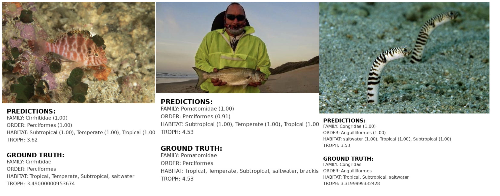

# Multi-Task Fish Classification using Mixture-of-Experts with DINOv3

A comprehensive fish species classification system leveraging DINOv3 vision transformers for multi-task learning on fish taxonomy and ecological attributes.

## Table of Contents
- [Overview](#overview)
- [Results](#results)
- [Dataset](#dataset)
- [Models](#models)
  - [FishNet (Linear Classifier)](#fishnet-linear-classifier)
  - [Multi-Head](#multi-head)
  - [Multi-Task MoE](#multi-task-moe)
- [Installation](#installation)
- [Quick Start](#quick-start)
- [Training](#training)
  - [Shell Scripts Reference](#shell-scripts-reference)
- [Monitoring](#monitoring)
- [Evaluation](#evaluation)
- [Project Structure](#project-structure)
- [References](#references)

---

## Overview

This project implements three different architectures for fish species classification and ecological attribute prediction, all built on top of DINOv3 pre-trained vision transformers. The models predict:

- **Family Classification**: 463 fish families (multiclass)
- **Order Classification**: Fish taxonomic orders (multiclass)
- **Habitat Attributes**: 8 binary attributes (multi-label)
  - Tropical, Temperate, Subtropical, Boreal, Polar
  - Freshwater, Saltwater, Brackish
- **Trophic Level**: Continuous value regression (1.0-5.0)
- **Feeding Path** *(optional)*: Categorical feeding strategies

The system uses a two-stage approach:
1. **Feature Extraction**: Extract dense DINOv3 features once
2. **Classifier Training**: Train lightweight classifiers on cached features

---

## Results

### Fish Family Classification (Single-Task)

Progressive improvements on FishNet classifier with DINOv3 features:

| Model Configuration | Train Acc | Val Acc | Test Acc |
|---------------------|-----------|---------|----------|
| **Baseline: ConvNeXt + Class Balance** | N/A | N/A | **0.613** |
| DINOv3 + train/val/test split | 0.995 | 0.788 | 0.787 |
| + Class balance weight + Standardize | 0.976 | 0.789 | 0.791 |
| + Warmup + LR Scheduler | 0.967 | 0.801 | 0.804 |
| **+ LayerNorm + Dropout (Best)** | **0.995** | **0.802** | **0.807** |

**Key Improvements:**
- **+19.4%** test accuracy over ConvNeXt baseline (0.613 → 0.807)
- Class balancing, feature standardization, and proper regularization are crucial
- Warmup + LR scheduling stabilizes training and improves generalization

---

### Multi-Task Learning (Family + Order + Habitat + Trophic Level)

Comparison of architectures for joint prediction of multiple fish attributes:

| Model | Family (Acc) | Order (Acc) | 8 Habitat (F1) | Trophic Level (MAE) |
|-------|--------------|-------------|----------------|---------------------|
| **Paper Baseline** (different models per task) | 0.614 | 0.744 | 0.817 | N/A |
| **Multi-Head** (4 FC heads) | **0.791** | 0.843 | 0.805 | 0.323 |
| **Multi-Task MoE** (Ours) | **0.791** | **0.850** | **0.842** | **0.255** |

**Key Findings:**
- **MoE outperforms Multi-Head** on 3 out of 4 tasks
  - Order: +0.7% accuracy (0.843 → 0.850)
  - Habitat: +3.7% F1 score (0.805 → 0.842)
  - Trophic: -21.1% MAE (0.323 → 0.255, lower is better)
- **Shared expert pool** in MoE enables better knowledge transfer across tasks
- Both DINOv3-based models significantly outperform paper baseline (+17.7% family accuracy)
- MoE's task-specific gating allows specialization while maintaining shared representations

---
### Results Visualization




### Summary

**Best Model per Task:**
- **Family Classification (Single-Task)**: FishNet + LayerNorm + Dropout → **80.7% accuracy**
- **Multi-Task Learning**: Multi-Task MoE → **Best on 3/4 tasks**
  - Family: 79.1% | Order: 85.0% | Habitat: 84.2% F1 | Trophic: 0.255 MAE

**Architecture Insights:**
1. **DINOv3 features** are highly effective for fish classification (+19.4% over ConvNeXt)
2. **Proper regularization** (dropout, LayerNorm) prevents overfitting on imbalanced data
3. **Expert sharing** (MoE) > Independent heads for multi-task scenarios
4. **Feature standardization** and **class balancing** are essential with imbalanced datasets


---

## Dataset

**FishNet Dataset Statistics:**
- **Total Images**: 94,532
  - Training: 75,631 images
  - Test: 18,901 images
- **Sources**: 
  - [FishNet Dataset](https://fishnet-2023.github.io/):
    - FishBase (web-scraped images): ~43,500 images
    - iNaturalist (local dataset): ~51,000 images
- **Classes**: 463 fish families
- **Distribution**: All families present in both train and test sets
- **Challenge**: Highly imbalanced with some families having as few as 4 training images

**Data Format:**
- Images organized by family folders
- CSV annotations with metadata (habitat, trophic level, etc.)
- Located in `datasets/fishnet/` and `datasets/anns/`

---

## Models

### FishNet (Linear Classifier)

**Architecture:**
- Simple yet effective 2-layer MLP classifier on frozen DINOv3 features
- LayerNorm → Linear(D, 2048) → GELU → Dropout → Linear(2048, num_classes)
- Optimized for single-task family classification

**Key Features:**
- Stratified train/val splitting to handle class imbalance
- Optional class-balanced weighting
- Feature standardization (z-score normalization)
- Multiple LR schedulers: Cosine, Linear, Step, Plateau
- Comprehensive regularization: Dropout, MixUp, Label Smoothing

**Location:** `dinov3/projects/fishnet2/`

**Best Hyperparameters:**
- Hidden dimension: 2048
- Learning rate: 1e-3 with cosine annealing
- Batch size: 256
- Dropout: 0.1-0.2
- Class weighting: balanced
- Feature standardization: enabled

---

### Multi-Head

**Architecture:**
- Task-specific heads applied directly on DINOv3 features
- Each task has independent 2-layer tower:
  - LayerNorm → Linear(D, 1024) → GELU → Dropout → Linear(1024, task_out)
- No shared computation between tasks (baseline for comparison)

**Tasks:**
- Family head (463 classes)
- Order head (83 classes)
- Habitat head (8 binary outputs)
- Trophic level head (regression)

**Key Features:**
- Simple parallel architecture
- Per-task optimization
- Baseline for comparing against MoE

**Location:** `dinov3/projects/multi_head/`

**Best Hyperparameters:**
- Tower hidden: 1024
- Learning rate: 1e-3
- Dropout: 0.1
- Batch size: 256

---

### Multi-Task MoE

**Architecture:**
- Gated Mixture-of-Experts (MMoE) with task-specific gates
- Shared expert pool (4 experts by default)
- Task-specific gating networks and output towers

**Components:**
1. **Expert Pool**: N shared expert networks (D → 2048)
   - Each expert: LayerNorm → Linear → GELU → Dropout → Linear → GELU
   
2. **Task Gates**: Softmax gating network per task
   - Learns task-specific mixing weights over experts
   - LayerNorm → Linear(D, num_experts)
   
3. **Task Towers**: Task-specific output heads
   - Linear(2048, 1024) → GELU → Dropout → Task Head
   - Different head architectures for classification/regression/multi-label

**Key Features:**
- Shared representations via expert pool
- Task-specific adaptation via gates
- Balanced multi-task learning with loss weighting
- Efficient: shares computation across tasks

**Location:** `dinov3/projects/multitask_moe/`

**Best Hyperparameters:**
- Experts: 4
- Expert hidden: 2048
- Tower hidden: 1024
- Learning rate: 2e-3
- Dropout: 0.1
- Loss weights: [1.0, 0.5, 0.5, 0.5] (family, order, habitat, troph)

---

## Installation

### Prerequisites
- Python 3.11
- CUDA-compatible GPU (recommended, 8GB+ VRAM)
- 16GB+ RAM
- ~50GB disk space for datasets and model weights

### Quick Setup (Recommended)

**Option 1: GPU Environment (CUDA 12.1)**
```bash
# Clone the repository
git clone https://github.com/facebookresearch/dinov3.git
cd dinov3

# Create conda environment with all dependencies
conda env create -f environment.yml

# Activate environment
conda activate fishnet

# Verify installation
python -c "import torch; print(f'PyTorch: {torch.__version__}, CUDA: {torch.cuda.is_available()}')"
```

**Option 2: CPU-Only Environment**
```bash
# For machines without GPU or for inference/evaluation only
conda env create -f environment-cpu.yml
conda activate fishnet-cpu
```

**Option 3: Different CUDA Version**
```bash
# Edit environment.yml and change:
# pytorch::pytorch-cuda=12.1  →  pytorch::pytorch-cuda=11.8

# Then create environment
conda env create -f environment.yml
conda activate fishnet
```

### Manual Installation (Alternative)

```bash
# Create environment manually
conda create -n fishnet python=3.11
conda activate fishnet

# Install PyTorch (adjust for your CUDA version)
conda install pytorch torchvision torchaudio pytorch-cuda=12.1 -c pytorch -c nvidia

# Install from requirements
pip install -r requirements.txt

# Install package in development mode
pip install -e .
```

### Verify Installation

```bash
# Test DINOv3 import
python -c "import dinov3; print('DINOv3 imported successfully')"

# Test FishNet modules
python -c "from dinov3.projects.fishnet2 import train_linear; print('FishNet modules available')"

# Check GPU availability
python -c "import torch; print(f'CUDA available: {torch.cuda.is_available()}')"
python -c "import torch; print(f'GPU count: {torch.cuda.device_count()}')"
```

### Optional: Weights & Biases Setup

```bash
# Install wandb (included in environment.yml)
pip install wandb

# Login to track experiments
wandb login

# Your API key will be saved for future runs
```

### Download Pretrained Weights

Download DINOv3 pretrained weights (requires access approval):
```bash
# ViT-L/16 (recommended for best performance)
wget <URL_TO_WEIGHTS> -O weights/dinov3_vitl16_pretrain_lvd1689m.pth

# ViT-S/16 (for faster inference)
wget <URL_TO_WEIGHTS> -O weights/dinov3_vits16_pretrain_lvd1689m.pth
```

---

## Quick Start

### 1. Extract Features

Extract DINOv3 features once and cache them:

```bash
python -m dinov3.projects.fishnet2.extract_features \
  --dataset-root datasets/fishnet \
  --ann-root datasets/anns \
  --output-dir artifacts/fishnet2_balanced/features \
  --hub-name dinov3_vitl16 \
  --weights weights/dinov3_vitl16_pretrain_lvd1689m.pth \
  --batch-size 256 \
  --num-workers 8 \
  --fp16
```

Output: `train_features.pt`, `test_features.pt`, `metadata.json`

### 2. Train FishNet Classifier

```bash
python -m dinov3.projects.fishnet2.train_linear \
  --train-features artifacts/fishnet2_balanced/features/train_features.pt \
  --test-features artifacts/fishnet2_balanced/features/test_features.pt \
  --output-dir artifacts/fishnet2/experiments \
  --epochs 50 \
  --batch-size 256 \
  --lr 1e-3 \
  --lr-scheduler cosine \
  --lr-warmup-epochs 5 \
  --hidden-dim 2048 \
  --dropout 0.1 \
  --class-weighting balanced \
  --standardize \
  --wandb \
  --wandb-project fishnet
```

### 3. Train Multi-Head Model

```bash
python -m dinov3.projects.multi_head.train_multihead \
  --features-dir artifacts/fishnet2_balanced/features \
  --ann-root datasets/anns \
  --output-dir artifacts/multihead_runs \
  --epochs 100 \
  --batch-size 256 \
  --lr 1e-3 \
  --lr-scheduler linear \
  --lr-warmup-epochs 5 \
  --tower-hidden 1024 \
  --dropout 0.1 \
  --class-weighting balanced \
  --standardize \
  --wandb
```

### 4. Train Multi-Task MoE

```bash
python -m dinov3.projects.multitask_moe.train_mmoe \
  --features-dir artifacts/fishnet2_balanced/features \
  --ann-root datasets/anns \
  --output-dir artifacts/mmoe_runs \
  --epochs 40 \
  --batch-size 256 \
  --lr 2e-3 \
  --experts 4 \
  --expert-hidden 2048 \
  --tower-hidden 1024 \
  --loss-weights 1.0 0.5 0.5 0.5 \
  --standardize \
  --wandb
```

---

## Training

### Experiment Management

All experiments are automatically organized with:
- Timestamped directories
- Complete config snapshots
- Checkpoint saving (best model)
- Comprehensive logging
- WandB integration (optional)

**Directory Structure:**
```
artifacts/
├── fishnet2/
│   └── experiments/
│       └── cosine_lr1e3_bs256_balanced_std_20251027_143052/
│           ├── config.json
│           ├── checkpoints/best_model.pt
│           ├── logs/training.log
│           └── results/metrics.json
├── multihead_runs/
│   └── multihead_4layers_lr1e3_20251028_094521/
│       └── ...
└── mmoe_runs/
    └── mmoe_4exp_lr2e3_20251028_101203/
        └── ...
```

### Key Training Arguments

**FishNet:**
- `--lr-scheduler`: {none, cosine, linear, step, plateau}
- `--lr-warmup-epochs`: Warmup period for LR scheduler
- `--class-weighting`: {none, balanced} - handle class imbalance
- `--standardize`: Z-score normalization of features
- `--dropout`: Dropout rate (default: 0.1)
- `--val-ratio`: Validation split ratio if no val set provided

**Multi-Task Models:**
- `--loss-weights`: Per-task loss weights (e.g., `1.0 0.5 0.5 0.5`)
- `--experts`: Number of experts in MoE
- `--expert-hidden`: Expert network hidden dimension
- `--tower-hidden`: Task tower hidden dimension

### Hyperparameter Tuning

See `run_multiple_experiments_vits.sh` and `run_multiple_experiments_vitl.sh` for batch experiment scripts.

**Key hyperparameters to tune:**
1. Learning rate: {1e-4, 5e-4, 1e-3, 2e-3}
2. Batch size: {128, 256, 512}
3. Dropout: {0.0, 0.1, 0.2, 0.3}
4. Hidden dimensions: {1024, 2048, 4096}
5. LR scheduler: {cosine, linear, step} with warmup
6. Regularization: MixUp, label smoothing, class weighting

### Shell Scripts Reference

The repository includes several convenience scripts for training and inference:

#### `run_single.sh`
**Purpose:** Train a single FishNet classifier experiment with standard hyperparameters.

```bash
./run_single.sh
```

**What it does:**
- Trains FishNet linear classifier on pre-extracted features
- Uses linear LR scheduler with 5-epoch warmup
- Applies balanced class weighting and feature standardization
- Logs to WandB
- Default: 100 epochs, batch size 256, lr=1e-3

**Use case:** Quick single experiment or testing configuration changes.

---

#### `run_multihead.sh`
**Purpose:** Train the Multi-Head baseline model for multi-task learning.

```bash
./run_multihead.sh
```

**What it does:**
- Trains separate task-specific heads (Family, Order, Habitat, Troph)
- 4-layer towers per task (configurable with `--num-layers`)
- Linear LR scheduler with warmup
- Runs on GPU 1 (modify `CUDA_VISIBLE_DEVICES` as needed)

**Use case:** Baseline comparison for multi-task models without expert sharing.

---

#### `run_moe.sh`
**Purpose:** Train the Multi-Task Mixture-of-Experts model.

```bash
./run_moe.sh
```

**What it does:**
- Trains MMoE with 8 experts (shared expert pool)
- Task-specific gating networks
- Expert hidden: 2048, Tower hidden: 1024
- Loss weights: [1.0, 0.5, 0.5, 0.5] for [Family, Order, Habitat, Troph]
- Runs on GPU 3 (modify `CUDA_VISIBLE_DEVICES` as needed)

**Use case:** Full multi-task training with expert sharing for improved generalization.

---

#### `run_inference.sh`
**Purpose:** Run inference and generate visualizations for a trained MMoE model.

```bash
./run_inference.sh
```

**What it does:**
- Loads best MMoE checkpoint
- Generates predictions on test set
- Creates visualizations (20 classes × 3 images per class)
- Saves results to `artifacts/mmoe_visualizations/`

**Use case:** Evaluate trained model and visualize predictions.

---

#### `run_multiple_experiments_vits.sh`
**Purpose:** Run comprehensive hyperparameter search with ViT-Small backbone.

```bash
./run_multiple_experiments_vits.sh
```

**What it does:**
- Extracts features using ViT-S/16 backbone (if not cached)
- Runs 5+ experiments with different hyperparameters:
  - Baseline: cosine scheduler, lr=1e-3, bs=256
  - Higher LR: lr=2e-3
  - Larger batch: bs=512
  - Step scheduler variants
  - Different hidden dimensions
- Each experiment auto-organized in separate timestamped directory

**Use case:** Systematic hyperparameter tuning for FishNet classifier.

---

#### `run_multiple_experiments_vitl.sh`
**Purpose:** Run comprehensive hyperparameter search with ViT-Large backbone.

```bash
./run_multiple_experiments_vitl.sh
```

**What it does:**
- Same as `run_multiple_experiments_vits.sh` but uses ViT-L/16
- Higher capacity model (304M params vs 86M)
- Extracts richer features for potentially better performance
- Requires more memory and compute

**Use case:** Best performance experiments using the largest backbone.

---

**Quick Tips:**
- Edit `CUDA_VISIBLE_DEVICES=X` in scripts to select GPU
- Modify hyperparameters directly in scripts or pass additional flags
- All scripts use WandB logging by default (disable with `--no-wandb` flag)
- Feature extraction is cached - only needs to run once per backbone

---

## Monitoring

### Weights & Biases

Enable WandB logging with `--wandb` flag:

```bash
wandb login
python -m dinov3.projects.fishnet2.train_linear --wandb --wandb-project fishnet ...
```

**Tracked Metrics:**
- Training/validation loss and accuracy
- Per-epoch learning rate
- Per-task metrics (for multi-task models)
- Confusion matrices
- Per-class precision/recall/F1

### Local Logs

All experiments save:
- `training.log`: Detailed per-batch logs
- `metrics.json`: Final train/val/test metrics
- `config.json`: Complete hyperparameter configuration
- `best_model.pt`: Best checkpoint based on validation metric

---

## Evaluation

### Test Set Evaluation 

```bash
# FishNet
python -m dinov3.projects.fishnet2.eval_model \
  --checkpoint artifacts/fishnet2/experiments/<exp_name>/checkpoints/best_model.pt \
  --test-features artifacts/fishnet2_balanced/features/test_features.pt

# Multi-Task MoE
python -m dinov3.projects.multitask_moe.inference_mmoe \
  --checkpoint artifacts/mmoe_runs/<exp_name>/checkpoints/best_model.pt \
  --features-dir artifacts/fishnet2_balanced/features \
  --ann-root datasets/anns
```


## Project Structure

```
dinov3/
├── dinov3/
│   └── projects/
│       ├── fishnet2/           # FishNet linear classifier
│       │   ├── extract_features.py
│       │   ├── train_linear.py
│       │   └── eval_model.py
│       ├── multi_head/          # Multi-head baseline
│       │   ├── models.py
│       │   └── train_multihead.py
│       └── multitask_moe/       # Mixture-of-Experts
│           ├── models.py
│           ├── train_mmoe.py
│           └── inference_mmoe.py
├── datasets/
│   ├── fishnet/                 # Image data
│   └── anns/                    # CSV annotations
├── artifacts/                   # Outputs
│   ├── fishnet2/
│   ├── multihead_runs/
│   └── mmoe_runs/
└── weights/                     # DINOv3 pretrained weights
```

---


### Inference on New Images

```python
import torch
from dinov3.hub import get_backbone

# Load DINOv3 backbone
backbone = torch.hub.load('facebookresearch/dinov3', 'dinov3_vitl16')
backbone.eval()

# Load trained classifier
classifier = torch.load('artifacts/fishnet2/experiments/<exp>/checkpoints/best_model.pt')

# Extract features and predict
with torch.no_grad():
    features = backbone(image_tensor)
    logits = classifier(features)
    prediction = logits.argmax(dim=-1)
```

---

## License

This project is licensed under the terms specified in the DINOv3 License Agreement. See [LICENSE.md](LICENSE.md) for details.

---

## References

```bibtex
@article{dinov3,
  title={DINOv3: Robust Self-Supervised Learning for Vision},
  author={Siméoni, Oriane and Vo, Huy V. and Seitzer, Maximilian and others},
  journal={arXiv preprint arXiv:2508.10104},
  year={2025}
}
@misc{fishnet2025,
  title={FishNet: Multi-Task Fish Species Classification with DINOv3},
  author={Your Name},
  year={2025},
  howpublished={\url{https://github.com/your-repo}}
}
```

---

## Acknowledgments

- **DINOv3**: Meta AI Research for the pretrained vision transformers
- **FishNet**: For fish taxonomy and ecological data
- **PyTorch**: Deep learning framework
- **Weights & Biases**: Experiment tracking

---

**Last Updated**: October 29, 2025
