# Baseline Multi-Task Architecture - Mermaid Diagram

## Baseline: Simple Linear Heads per Task

```mermaid
%%{init: {'theme':'base', 'themeVariables': { 'fontSize':'18px', 'fontFamily':'Arial, Helvetica, sans-serif'}}}%%
flowchart TB
    Input["<b>Input Image</b>"]
    Backbone["<b>Frozen DINOv3</b>"]
    Features["<b>Shared Features</b>"]

    Input --> Backbone --> Features

    subgraph Tasks["<b>Task-Specific Linear Heads (Baseline)</b>"]
        direction LR

        subgraph TaskFamily["🔴 <b>Family Task</b>"]
            direction TB
            HF["<b>FC Head F</b>"]
            OF["<b>Family Out</b>"]
            HF --> OF
        end

        subgraph TaskOrder["🔵 <b>Order Task</b>"]
            direction TB
            HO["<b>FC Head O</b>"]
            OO["<b>Order Out</b>"]
            HO --> OO
        end

        subgraph TaskHabitat["🟢 <b>Habitat Task</b>"]
            direction TB
            HH["<b>FC Head H</b>"]
            OH["<b>Habitat Out</b>"]
            HH --> OH
        end

        subgraph TaskTroph["🟣 <b>Troph Task</b>"]
            direction TB
            HT["<b>FC Head T</b>"]
            OT["<b>Troph Out</b>"]
            HT --> OT
        end
    end

    %% Features fan-out to each simple FC head
    Features --> HF
    Features --> HO
    Features --> HH
    Features --> HT

    %% Loss aggregation (sum / weighted sum)
    Loss["<b>Multi-Task Loss</b><br/>(sum / weighted)"]
    OF --> Loss
    OO --> Loss
    OH --> Loss
    OT --> Loss

    %% Styling (mirrors MMoE Version 3 figure)
    style Input fill:#E8EAF6,stroke:#5C6BC0,stroke-width:2px,color:#1A237E
    style Backbone fill:#C5CAE9,stroke:#5C6BC0,stroke-width:2px,color:#1A237E
    style Features fill:#9FA8DA,stroke:#5C6BC0,stroke-width:3px,color:#fff

    style Tasks fill:#FAFAFA,stroke:#757575,stroke-width:2px

    style TaskFamily fill:#FCE4EC,stroke:#C2185B,stroke-width:2px
    style TaskOrder fill:#E1F5FE,stroke:#0277BD,stroke-width:2px
    style TaskHabitat fill:#E8F5E9,stroke:#2E7D32,stroke-width:2px
    style TaskTroph fill:#F3E5F5,stroke:#6A1B9A,stroke-width:2px

    style HF fill:#F8BBD0,stroke:#C2185B,stroke-width:2px,color:#880E4F
    style HO fill:#B3E5FC,stroke:#0277BD,stroke-width:2px,color:#01579B
    style HH fill:#C8E6C9,stroke:#2E7D32,stroke-width:2px,color:#1B5E20
    style HT fill:#E1BEE7,stroke:#6A1B9A,stroke-width:2px,color:#4A148C

    style OF fill:#D81B60,stroke:#880E4F,stroke-width:3px,color:#fff
    style OO fill:#0288D1,stroke:#01579B,stroke-width:3px,color:#fff
    style OH fill:#388E3C,stroke:#1B5E20,stroke-width:3px,color:#fff
    style OT fill:#7B1FA2,stroke:#4A148C,stroke-width:3px,color:#fff

    style Loss fill:#FFF176,stroke:#F57F17,stroke-width:3px,color:#E65100
```

## Key Differences from MMoE

- **Baseline**: Each task has a simple linear (FC) head directly from shared features
- **MMoE**: Each task has a gating network, weighted expert mixture, and task-specific tower

## How to Use

Paste this into:
- GitHub/GitLab markdown files
- [Mermaid Live Editor](https://mermaid.live)
- Notion, Obsidian, Confluence

## Comparison

| Architecture | Components per Task |
|--------------|-------------------|
| **Baseline** | 1 FC Head |
| **MMoE** | Gate + Expert Mixture + Tower |
