# MMoE Architecture - Mermaid Diagram

## Version 1: Detailed Architecture (Flowchart)

## Version 2: Simplified Architecture (with Emojis)

```mermaid
flowchart TD
    Input["📷 Input Image"] --> Backbone["🔒 Frozen DINOv3 ViT-L"]
    Backbone --> Features["📊 Features"]
    
    Features --> Experts["🔧 Shared Experts E1...EN"]
    Features --> Gates["🎯 Task-Specific Gates"]
    
    Experts --> Mix["⚖️ Weighted Combination"]
    Gates -.weights.-> Mix
    
    Mix --> Towers["🏗️ Task Towers"]
    
    Towers --> Out1["🔴 Family"]
    Towers --> Out2["🔵 Order"]
    Towers --> Out3["🟢 Habitat"]
    Towers --> Out4["🟣 Trophic Level"]
    
    style Input fill:#C5CAE9,stroke:#3F51B5
    style Backbone fill:#9FA8DA,stroke:#3F51B5
    style Features fill:#7986CB,stroke:#3F51B5,color:#fff
    style Experts fill:#FFE082,stroke:#FFA726
    style Gates fill:#FFCA28,stroke:#FF8F00
    style Mix fill:#FFF59D,stroke:#FBC02D
    style Towers fill:#E1F5FE,stroke:#0288D1
    style Out1 fill:#EF5350,stroke:#C62828,color:#fff
    style Out2 fill:#42A5F5,stroke:#1565C0,color:#fff
    style Out3 fill:#66BB6A,stroke:#2E7D32,color:#fff
    style Out4 fill:#AB47BC,stroke:#6A1B9A,color:#fff
```

## Version 3: Side-by-Side Task Paths

```mermaid
%%{init: {'theme':'base', 'themeVariables': { 'fontSize':'18px', 'fontFamily':'Arial, Helvetica, sans-serif'}}}%%
flowchart TB
    Input["<b>Input Image</b>"]
    Backbone["<b>Frozen DINOv3</b>"]
    Features["<b>Shared Features</b>"]
    
    Input --> Backbone --> Features
    
    subgraph Experts["<b>Shared Expert Network</b>"]
        direction LR
        E1["<b>Expert 1</b>"]
        E2["<b>Expert 2</b>"]
        E3["<b>Expert 3</b>"]
        E4["<b>Expert 4</b>"]
    end
    
    Features --> Experts
    
    subgraph Tasks["<b>Task-Specific Paths</b>"]
        direction LR
        
        subgraph TaskFamily["🔴 <b>Family Task</b>"]
            direction TB
            GF{"<b>Gate F</b>"}
            MF(("<b>Mix F</b>"))
            TF["<b>Tower F</b>"]
            OF["<b>Family Out</b>"]
            GF --> MF
            MF --> TF --> OF
        end
        
        subgraph TaskOrder["🔵 <b>Order Task</b>"]
            direction TB
            GO{"<b>Gate O</b>"}
            MO(("<b>Mix O</b>"))
            TO["<b>Tower O</b>"]
            OO["<b>Order Out</b>"]
            GO --> MO
            MO --> TO --> OO
        end
        
        subgraph TaskHabitat["🟢 <b>Habitat Task</b>"]
            direction TB
            GH{"<b>Gate H</b>"}
            MH(("<b>Mix H</b>"))
            TH["<b>Tower H</b>"]
            OH["<b>Habitat Out</b>"]
            GH --> MH
            MH --> TH --> OH
        end
        
        subgraph TaskTroph["🟣 <b>Troph Task</b>"]
            direction TB
            GT{"<b>Gate T</b>"}
            MT(("<b>Mix T</b>"))
            TT["<b>Tower T</b>"]
            OT["<b>Troph Out</b>"]
            GT --> MT
            MT --> TT --> OT
        end
    end
    
    Experts -.-> MF
    Experts -.-> MO
    Experts -.-> MH
    Experts -.-> MT
    
    Features --> GF
    Features --> GO
    Features --> GH
    Features --> GT
    
    style Input fill:#E8EAF6,stroke:#5C6BC0,stroke-width:2px,color:#1A237E
    style Backbone fill:#C5CAE9,stroke:#5C6BC0,stroke-width:2px,color:#1A237E
    style Features fill:#9FA8DA,stroke:#5C6BC0,stroke-width:3px,color:#fff
    style Experts fill:#FFF8E1,stroke:#F9A825,stroke-width:3px,color:#F57F17
    style E1 fill:#FFE082,stroke:#FFA726,stroke-width:2px,color:#E65100
    style E2 fill:#FFE082,stroke:#FFA726,stroke-width:2px,color:#E65100
    style E3 fill:#FFE082,stroke:#FFA726,stroke-width:2px,color:#E65100
    style E4 fill:#FFE082,stroke:#FFA726,stroke-width:2px,color:#E65100
    style Tasks fill:#FAFAFA,stroke:#757575,stroke-width:2px
    style TaskFamily fill:#FCE4EC,stroke:#C2185B,stroke-width:2px
    style TaskOrder fill:#E1F5FE,stroke:#0277BD,stroke-width:2px
    style TaskHabitat fill:#E8F5E9,stroke:#2E7D32,stroke-width:2px
    style TaskTroph fill:#F3E5F5,stroke:#6A1B9A,stroke-width:2px
    style GF fill:#F06292,stroke:#AD1457,stroke-width:2px,color:#fff
    style GO fill:#4FC3F7,stroke:#01579B,stroke-width:2px,color:#fff
    style GH fill:#66BB6A,stroke:#1B5E20,stroke-width:2px,color:#fff
    style GT fill:#BA68C8,stroke:#4A148C,stroke-width:2px,color:#fff
    style MF fill:#EC407A,stroke:#880E4F,stroke-width:2px,color:#fff
    style MO fill:#29B6F6,stroke:#01579B,stroke-width:2px,color:#fff
    style MH fill:#66BB6A,stroke:#1B5E20,stroke-width:2px,color:#fff
    style MT fill:#AB47BC,stroke:#4A148C,stroke-width:2px,color:#fff
    style TF fill:#F8BBD0,stroke:#C2185B,stroke-width:2px,color:#880E4F
    style TO fill:#B3E5FC,stroke:#0277BD,stroke-width:2px,color:#01579B
    style TH fill:#C8E6C9,stroke:#2E7D32,stroke-width:2px,color:#1B5E20
    style TT fill:#E1BEE7,stroke:#6A1B9A,stroke-width:2px,color:#4A148C
    style OF fill:#D81B60,stroke:#880E4F,stroke-width:3px,color:#fff
    style OO fill:#0288D1,stroke:#01579B,stroke-width:3px,color:#fff
    style OH fill:#388E3C,stroke:#1B5E20,stroke-width:3px,color:#fff
    style OT fill:#7B1FA2,stroke:#4A148C,stroke-width:3px,color:#fff
```

## How to Use

You can paste any of these Mermaid codes directly into:
- **GitHub README.md** or any markdown file (auto-renders)
- **GitLab** documentation  
- **Notion** pages
- **Obsidian** notes
- **Confluence** pages
- Any platform that supports Mermaid diagrams

## Tips

- **Version 1**: Most detailed, shows all experts and connections
- **Version 2**: Simplified overview, good for presentations
- **Version 3**: Shows task separation with subgraphs, easier to follow individual task paths

## Live Preview

To preview and edit these diagrams:
1. Visit [Mermaid Live Editor](https://mermaid.live)
2. Paste any version above
3. Export as PNG or SVG
4. Customize colors and layout as needed
